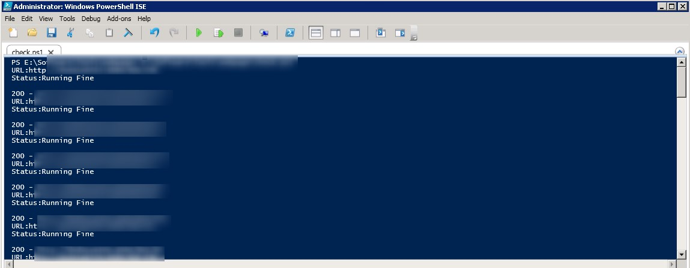
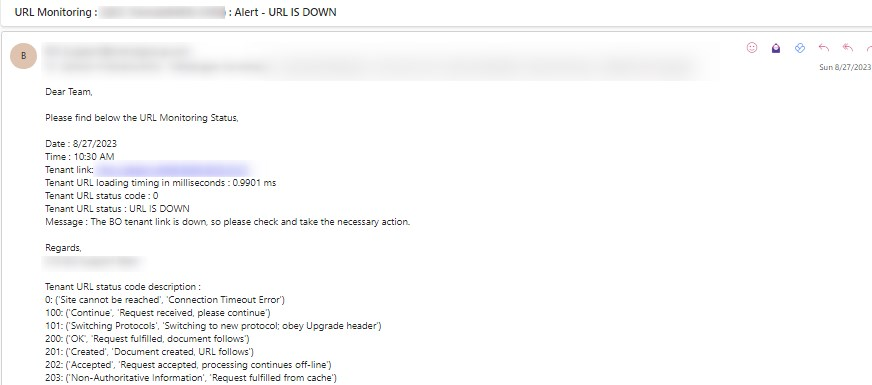

# URL_STATUS_MONITORING
SAP BO URL status monitoring

<b>** URL  **<b>
1.Problem overview:
  An individual needs to check the 30+ URL’s status of the environment every ten minutes.
  If any URL is down, it will significantly affect the business users.
2.Proposed solution :
  The PowerShell script is used to check the server, while acting as a gateway or proxy, received an invalid response from the upstream server.

  To reduce the manual effort, we have enabled auto monitoring for all our URL's so we can get a mail alert if any URL is down. 

3.ImPLementation Approach 
  By using PowerShell scripting, we have automated the "Environment URLs status" monitoring task.

  In this URL monitoring task runs every 2 minutes once and generates a mail notification only when the environment is down.

At present, we can receive all environment status (up or down) in an email.
